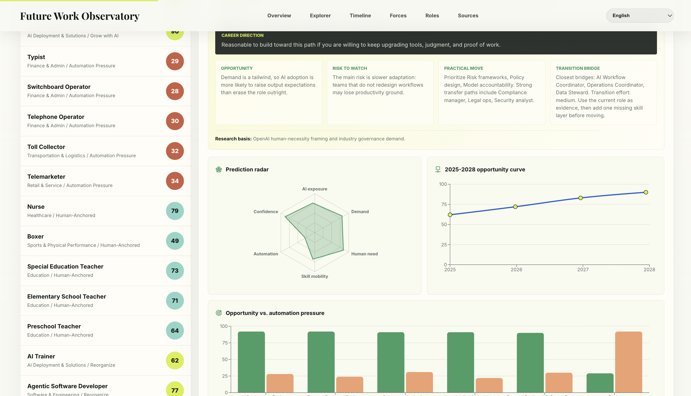

# job-trending

Future Work Observatory is an interactive career trend explorer for 2025-2028 job transition signals, AI exposure, automation pressure, and practical career migration paths.



## Live Demo

https://job-trending.ai-creator.top/

## What It Does

This project presents a product-style exhibition page for understanding how different careers may change between 2025 and 2028. It is designed for people who are choosing, changing, or rethinking their career direction in the AI era.

The site combines curated research signals with a broad career catalog that includes technology, engineering, finance, design, media, healthcare, education, law, public service, sports, manufacturing, logistics, traditional trades, and emerging AI-related roles.

Each role includes:

- 2028 opportunity score
- Automation pressure and human-need signals
- Radar chart and opportunity trend curve
- Objective career assessment
- Practical transition suggestions
- Nearby career bridge recommendations
- Internationalized interface with English as the default language

## Research Basis

The forecasting model is informed by public research and occupational datasets, including:

- OpenAI AI jobs transition research
- Anthropic Economic Index and AI usage research
- U.S. Bureau of Labor Statistics occupational outlook data
- World Economic Forum future jobs research
- PwC AI and labor-market reports
- O*NET occupation data
- Chinese occupational classification data
- Qianmu career reference data

The scores are directional forecasts, not absolute career advice. The goal is to make labor-market change easier to inspect and compare.

## Tech Stack

- React
- Vite
- Recharts
- Web Worker search
- Netlify deployment

## Development

```bash
npm install
npm run dev
```

## Build

```bash
npm run build
```
